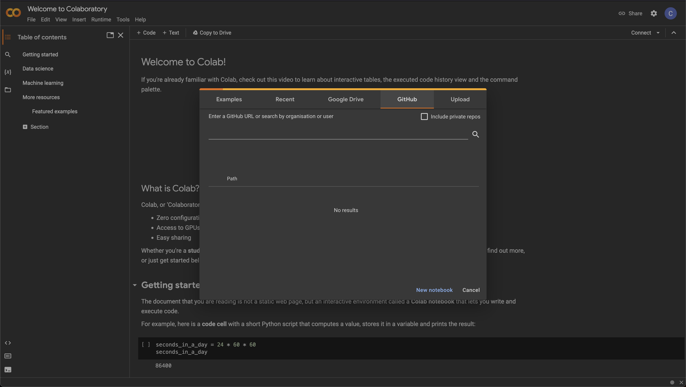
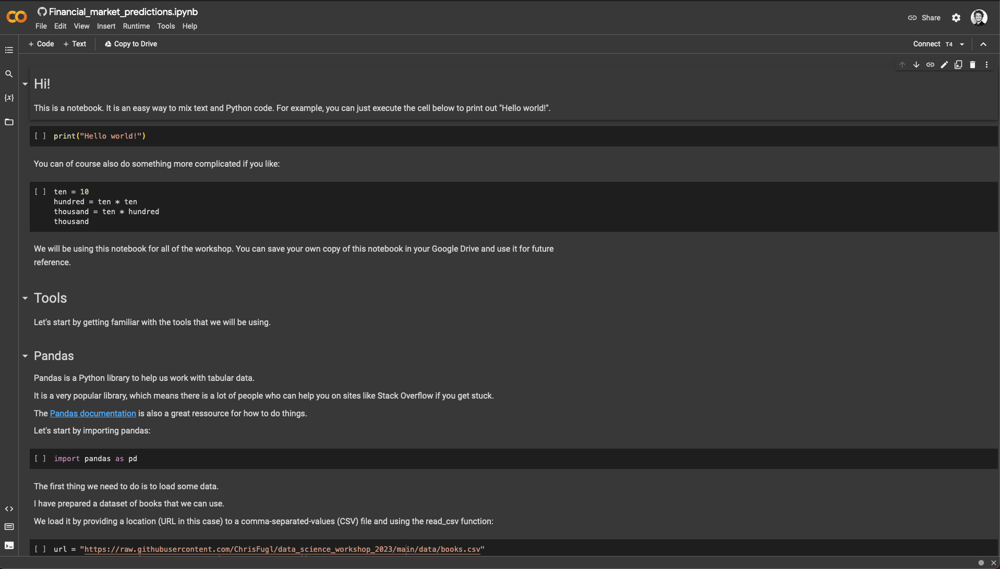
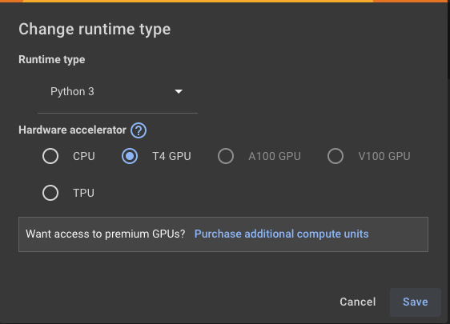
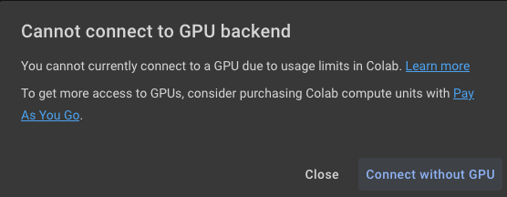

# Data Science Workshop 2023
Let's get started.

First you will need to go to the following URL in your browser and login with your Google account: [colab.research.google.com](https://colab.research.google.com)

Select the github tab as shown below:



Ented this URL into the text field:

``` txt
https://github.com/ChrisFugl/data_science_workshop_2023/blob/main/Financial_market_predictions.ipynb
```

Click the search (magnifying glass) icon.

That should open a notebook that looks like this:



Now click on the "Copy to Drive" button. This will open a new tab and you should close the previous tab.

Feel free to rename the copied notebook as you like.

We would like to use a GPU. You do this by:

1. Click "Runtime" in the navigation
2. Select "Change runtime type"
3. Make sure that "T4 GPU" is selected in the popup, as shown in this screenshot:



4. Click "Save"

Sometimes, it happens that you get unlucky, and Google will tell you that there is no GPU available:



That is okay. You just click "Connect without GPU" if that happens. You will still be able to do most things. It is only towards the very end of the notebook that we will be in need of a GPU.
